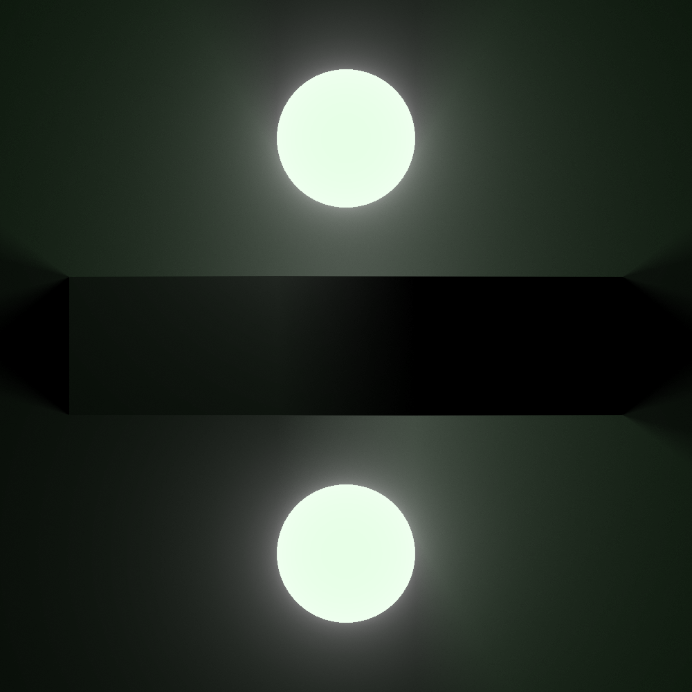
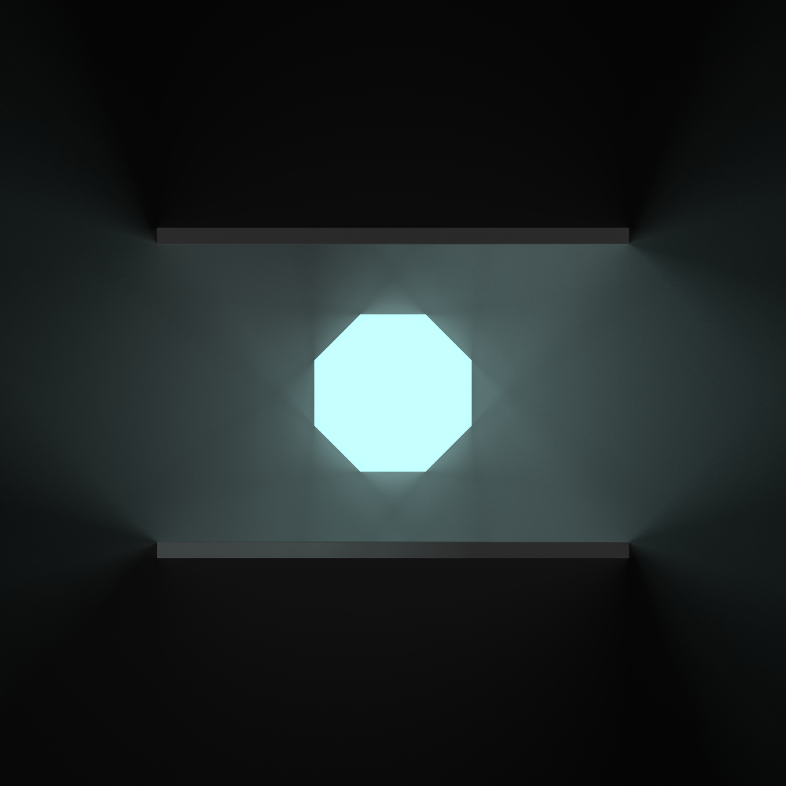
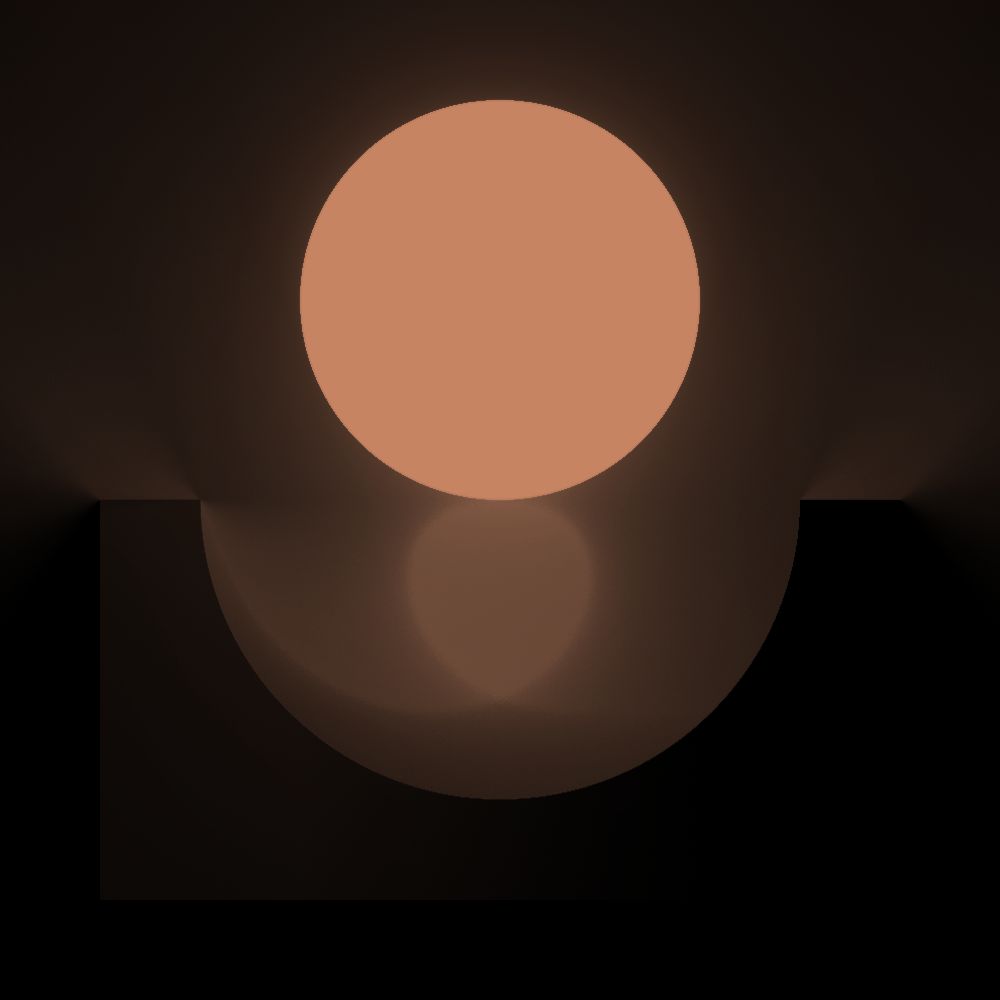
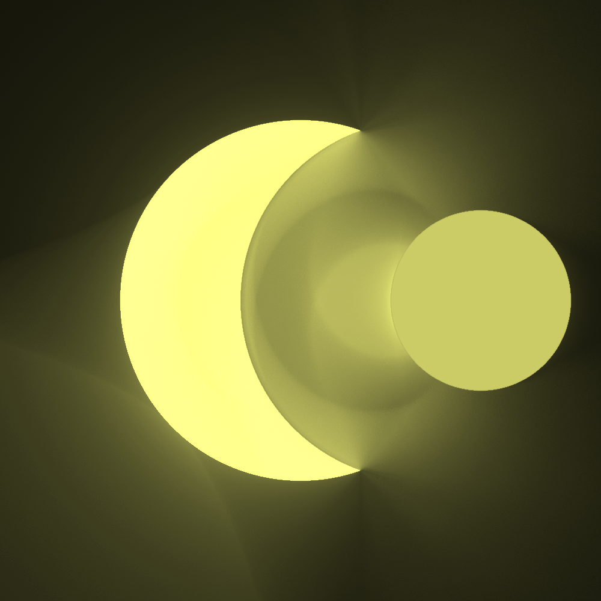

# 2D Renderer

  
   
  
  

## Features

- Reflection & Refraction
- CSG Operations
- Light Absorption

## References

- [light2d](https://github.com/miloyip/light2d)
- [2D distance functions](https://iquilezles.org/articles/distfunctions2d/)
